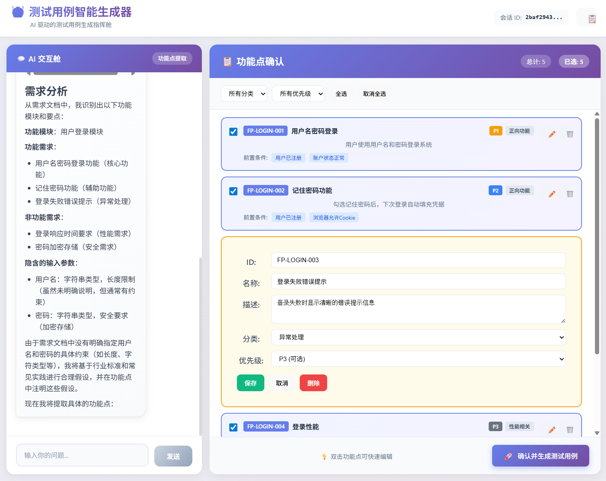
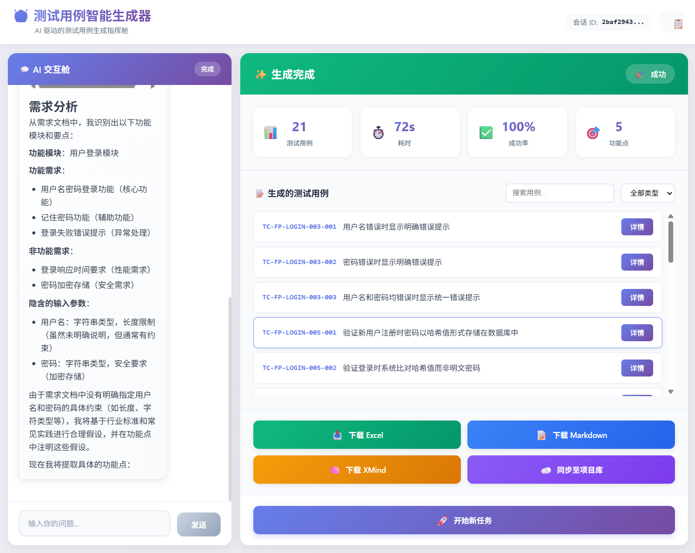

# TestCase Agent

[](https://opensource.org/licenses/MIT)
[](https://www.typescriptlang.org/)
[](https://vuejs.org/)
[](https://nestjs.com/)

> 🤖 一个基于 AI 的测试用例生成系统，支持人机协作（HITL）审批流程。

TestCase Agent 是一个智能测试助手，能够从需求文档中提取功能点并使用大语言模型生成全面的测试用例。它采用双阶段架构，在需求澄清阶段引入交互式人工确认，确保生成结果符合预期。

[架构设计](./design/architecture.md) • [问题反馈](../../issues) • [功能建议](../../issues)

---

## ✨ 功能特性

- **📄 智能需求分析** - 自动从 Markdown 文档中提取功能点
- **🤝 人机协作** - 需求澄清阶段的交互式审批流程
- **⚡ 并行生成** - 支持配置并发工作数的测试用例生成
- **📊 质量分析** - 覆盖率指标、优先级分布和缺口分析
- **📥 导出支持** - 支持导出 Excel/JSON 格式的测试用例
- **🔌 SSE 实时更新** - 生成过程中的实时进度流

## 🏗️ 系统架构

```
┌─────────────┐     ┌─────────────┐     ┌─────────────────┐
│  Vue3 前端  │────▶│  NestJS API │────▶│  LangGraph 智能体│
│             │◀────│   (后端)     │◀────│   (LLM 引擎)    │
└─────────────┘     └─────────────┘     └─────────────────┘
                            │                    │
                            ▼                    ▼
                      ┌─────────────┐     ┌─────────────┐
                      │   SQLite    │     │  DashScope  │
                      │  (会话存储)  │     │    API      │
                      └─────────────┘     └─────────────┘
```

**双阶段工作流：**

### 第一阶段：需求澄清



AI 分析需求文档，提取功能点并通过交互式界面等待用户确认。用户可以批准、编辑或拒绝功能点列表。

### 第二阶段：用例生成



确认功能点后，系统并行生成测试用例，实时显示进度，最终提供质量分析报告和导出功能。

## 🚀 快速开始

### 环境要求

- [Node.js](https://nodejs.org/) ≥ 18
- [pnpm](https://pnpm.io/) ≥ 10.0.0
- [DashScope API Key](https://help.aliyun.com/zh/model-studio/get-api-key)（或兼容的 OpenAI API）

### 安装

```bash
# 克隆仓库
git clone <repository-url>
cd test-case-clone

# 安装依赖
pnpm install
```

### 配置

```bash
cd apps/nestjs-service
cp .env.example .env
```

编辑 `.env`：

```bash
# 必填：DashScope API Key
DASHSCOPE_API_KEY=sk-your-api-key

# 选填：模型配置（显示为默认值）
DASHSCOPE_LLM_MODEL=qwen-plus
DASHSCOPE_BASE_URL=https://dashscope.aliyuncs.com/compatible-mode/v1
```

### 开发

```bash
# 启动所有服务（前端 + 后端）
pnpm dev

# 前端：http://localhost:5173
# 后端 API：http://localhost:3000
```

### 构建

```bash
# 构建所有应用
pnpm build

# 输出目录：
# - apps/nestjs-service/dist
# - apps/vue3-app/dist
```

## 📖 使用指南

1. **创建会话** - 输入 Markdown 格式的需求文档
2. **审阅功能点** - AI 提取功能点供你确认
3. **按需编辑** - 提供反馈以优化功能点列表
4. **生成测试用例** - 确认后开始并行生成
5. **下载结果** - 导出带质量指标的 Excel 文件

## 🛠️ 技术栈

| 层级 | 技术 |
|------|------|
| 前端 | Vue 3.5, TypeScript, Vite, vue-router |
| 后端 | NestJS 11, TypeScript |
| AI 引擎 | LangGraph, LangChain, DashScope API |
| 状态管理 | LangGraph MemorySaver (SQLite) |
| 构建系统 | Turborepo, pnpm workspaces |

## 📁 项目结构

```
.
├── apps/
│   ├── nestjs-service/          # NestJS 后端 API
│   │   └── src/agent-for-test-case/     # TestCase Agent 核心
│   │       ├── phase1/          # 需求澄清
│   │       ├── phase2/          # 测试用例生成
│   │       └── shared/          # 技能与工具
│   └── vue3-app/                # Vue3 前端
│       └── src/
│           ├── views/           # TestCaseAgentView.vue
│           └── components/      # 聊天与工作区组件
├── packages/
│   └── utils/                   # 共享工具
├── design/
│   └── architecture.md          # 详细架构文档
├── package.json
├── pnpm-workspace.yaml
└── turbo.json
```

## 🔧 高级配置

### 环境变量

| 变量 | 必填 | 默认值 | 说明 |
|------|------|--------|------|
| `DASHSCOPE_API_KEY` | ✅ | - | LLM 访问的 API 密钥 |
| `DASHSCOPE_LLM_MODEL` | ❌ | `qwen-plus` | 模型名称 |
| `DASHSCOPE_BASE_URL` | ❌ | DashScope 端点 | API 基础地址 |
| `TESTCASE_LLM_MODEL` | ❌ | - | 测试生成的覆盖模型 |

### 生成参数

```typescript
// POST /api/v1/testcase-agent/generation/start
{
  "session_id": "uuid",
  "feature_points": [...],
  "max_concurrent": 10  // 并发工作数（默认：10）
}
```

## 🤝 贡献指南

欢迎提交贡献！请随时提交 Pull Request。

1. Fork 本仓库
2. 创建功能分支（`git checkout -b feature/AmazingFeature`）
3. 提交更改（`git commit -m 'Add some AmazingFeature'`）
4. 推送到分支（`git push origin feature/AmazingFeature`）
5. 打开 Pull Request

## 📝 许可证

基于 MIT 许可证分发。详见 [LICENSE](./LICENSE)。

## 🙏 致谢

- [LangGraph](https://github.com/langchain-ai/langgraph) - HITL 工作流框架
- [DashScope](https://dashscope.aliyun.com/) - 大语言模型 API
- [NestJS](https://nestjs.com/) - 健壮的后端框架
- [Vue.js](https://vuejs.org/) - 响应式前端框架

---

<p align="center">
  用 ❤️ 打造，让软件测试更美好
</p>