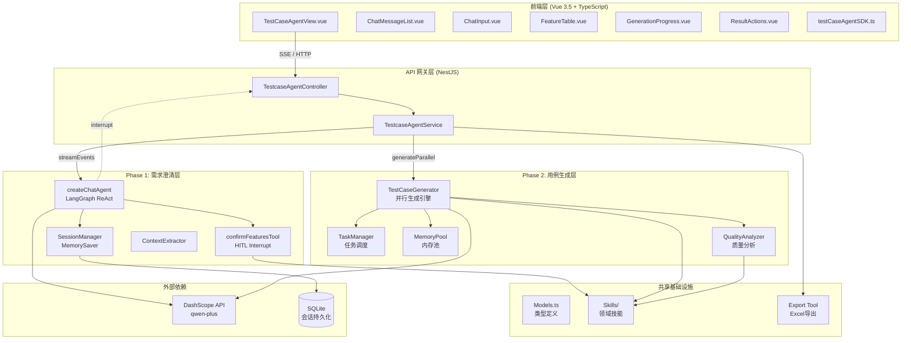
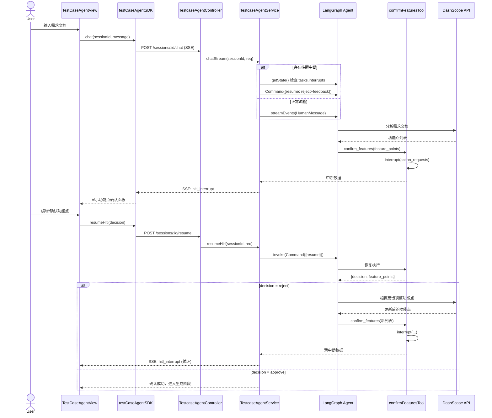
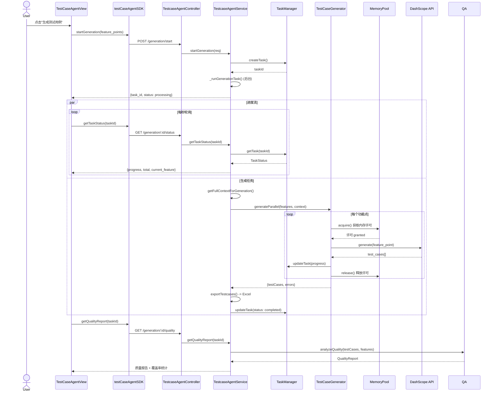
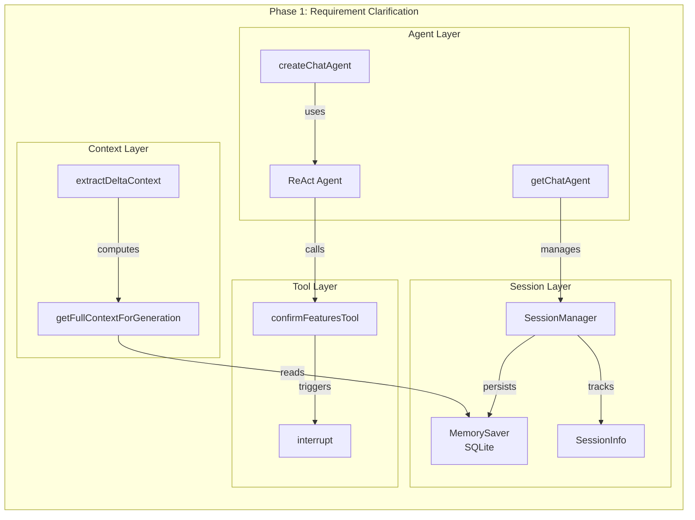
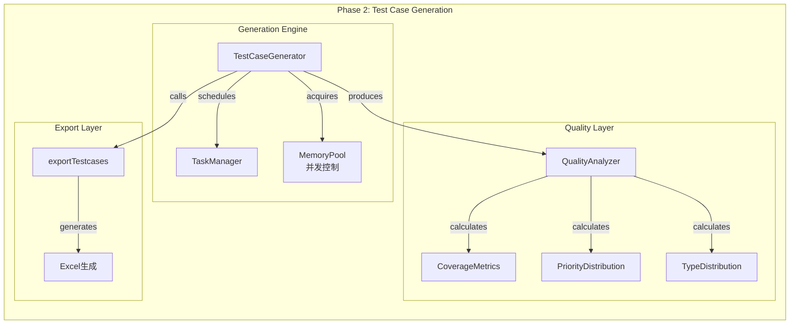
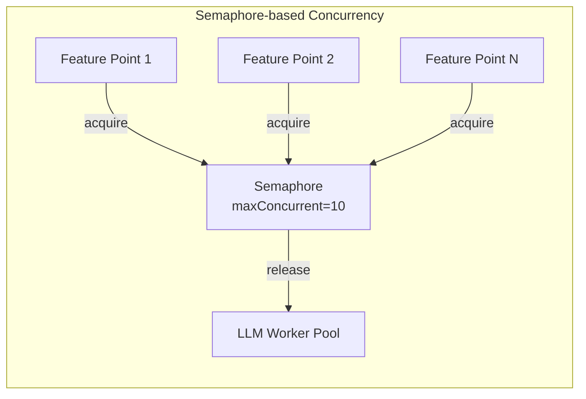
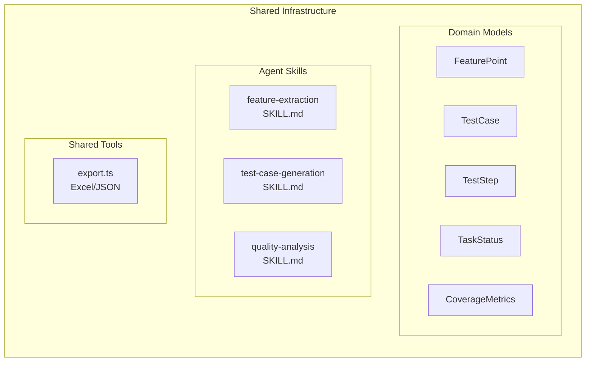
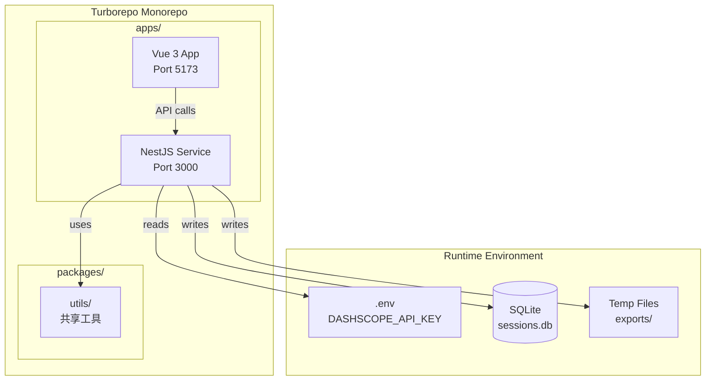
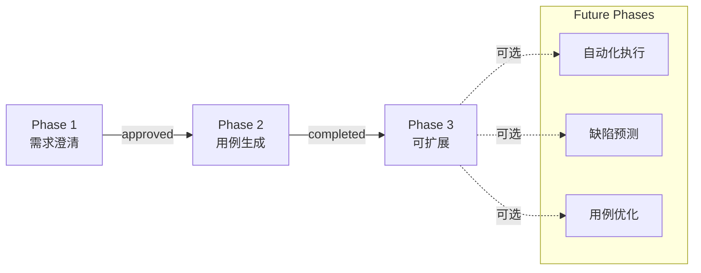

# TestCase Agent v5.3 架构设计文档

## 1. 整体架构概览



## 2. 核心流程时序图

### 2.1 Phase 1: 需求澄清流程 (HITL)



### 2.2 Phase 2: 并行生成流程



## 3. 模块详细设计

### 3.1 Phase 1 模块 (需求澄清)



**关键设计决策：**

| 组件 | 职责 | 技术选型 |
|------|------|----------|
| ReAct Agent | 需求分析、功能点提取 | `@langchain/langgraph/prebuilt` |
| confirmFeaturesTool | 触发 HITL 中断 | `interrupt()` from LangGraph |
| SessionManager | 会话生命周期管理 | 单例模式 + SQLite |
| MemorySaver | 图状态持久化 | LangGraph 内置 checkpointer |
| ContextExtractor | Phase 1→2 语境传承 | 增量上下文计算 |

### 3.2 Phase 2 模块 (用例生成)



**并发控制模型：**



### 3.3 共享基础设施



## 4. 数据流架构

### 4.1 状态管理

```mermaid
graph TB
    subgraph StateManagement["State Management"]
        direction TB
        
        subgraph GraphState["LangGraph State"]
            GS_MESSAGES[messages: BaseMessage[]]
            GS_CHECKPOINT[checkpoint: Checkpoint]
        end
        
        subgraph SessionState["Session State"]
            SS_ID[session_id: string]
            SS_PROJECT[project_id: number]
            SS_CREATED[created_at: Date]
            SS_HISTORY[history: Message[]]
        end
        
        subgraph TaskState["Task State"]
            TS_ID[task_id: string]
            TS_STATUS[status: pending/processing/completed/failed]
            TS_PROGRESS[progress: number]
            TS_RESULT[result: GenerationResult]
        end
    end
    
    GS_CHECKPOINT -->|persisted by| MS[MemorySaver]
    SS_HISTORY -->|managed by| SM[SessionManager]
    TS_RESULT -->|tracked by| TM[TaskManager]
```

### 4.2 API 接口矩阵

| 端点 | 方法 | 功能 | 响应类型 |
|------|------|------|----------|
| `/sessions` | POST | 创建会话 | JSON |
| `/sessions/:id/chat` | POST | SSE 对话流 | SSE |
| `/sessions/:id/resume` | POST | 恢复 HITL | JSON |
| `/generation/start` | POST | 启动生成 | JSON |
| `/generation/:id/status` | GET | 查询状态 | JSON |
| `/generation/:id/stream` | GET | 进度流 | SSE |
| `/generation/:id/quality` | GET | 质量报告 | JSON |
| `/generation/:id/download` | GET | 下载文件 | File |

## 5. 部署架构



## 6. 关键设计模式

### 6.1 HITL (Human-in-the-Loop) 模式

```mermaid
graph LR
    A[Agent 运行] -->|调用工具| B[confirm_features]
    B -->|interrupt| C[暂停执行]
    C -->|保存状态| D[Checkpoint]
    D -->|等待| E[人类决策]
    E -->|Command(resume)| F[恢复执行]
    F -->|返回决策| B
    B -->|返回结果| A
```

### 6.2 并发生成模式

```mermaid
graph TB
    subgraph ParallelGeneration["Parallel Generation Pattern"]
        A[输入: FeaturePoints[]] --> B{分片}
        B -->|chunk 1| W1[Worker 1]
        B -->|chunk 2| W2[Worker 2]
        B -->|chunk N| WN[Worker N]
        
        W1 -->|results| C[结果聚合]
        W2 -->|results| C
        WN -->|results| C
        
        C --> D[质量分析]
        D --> E[导出文件]
    end
```

## 7. 扩展性设计

### 7.1 新增 Phase 的可能性



### 7.2 多 LLM 提供商支持

当前通过 `ChatOpenAI` 的兼容模式支持 DashScope，未来可扩展：

```typescript
// config.ts
interface LLMProvider {
  name: 'dashscope' | 'openai' | 'azure' | 'claude';
  model: string;
  baseURL: string;
  apiKey: string;
}
```

## 8. 目录结构

```
apps/nestjs-service/src/agent-for-test-case/testcase/
├── AGENTS.md                    # 项目级规范
├── config.ts                    # 全局配置
├── index.ts                     # 统一导出
├── testcase-agent-module.ts     # NestJS 模块定义
├── testcase-agent.controller.ts # REST/SSE 控制器
├── testcase-agent.service.ts    # 业务逻辑服务
├── phase1/                      # 需求澄清阶段
│   ├── agent.ts                 # LangGraph Agent 工厂
│   ├── tools.ts                 # confirm_features 工具
│   ├── session-manager.ts       # 会话管理
│   ├── context.ts               # 语境提取
│   └── index.ts
├── phase2/                      # 用例生成阶段
│   ├── generator.ts             # 并行生成引擎
│   ├── task-manager.ts          # 任务调度
│   ├── memory-pool.ts           # 内存池（并发控制）
│   ├── quality-analyzer.ts      # 质量分析
│   └── index.ts
└── shared/                      # 共享基础设施
    ├── models.ts                # 类型定义
    ├── skills/                  # 领域技能（Markdown）
    │   ├── feature-extraction/
    │   ├── test-case-generation/
    │   └── quality-analysis/
    └── tools/                   # 共享工具
        ├── export.ts            # Excel/JSON 导出
        └── index.ts
```

---

**版本**: v5.3.0  
**最后更新**: 2026-03-22
